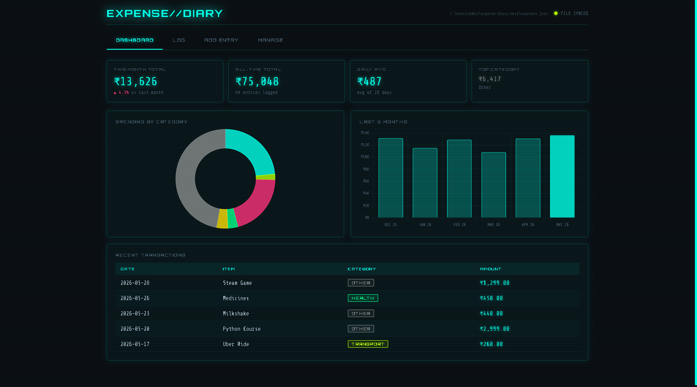
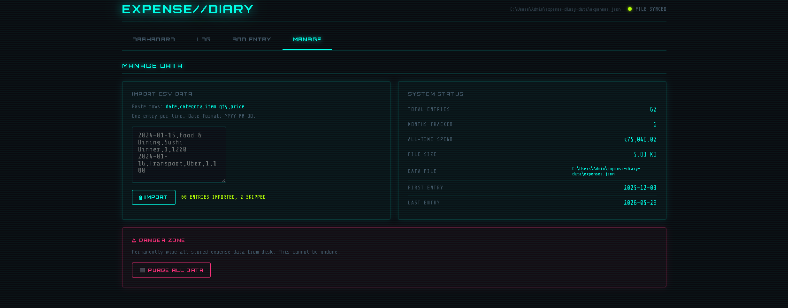
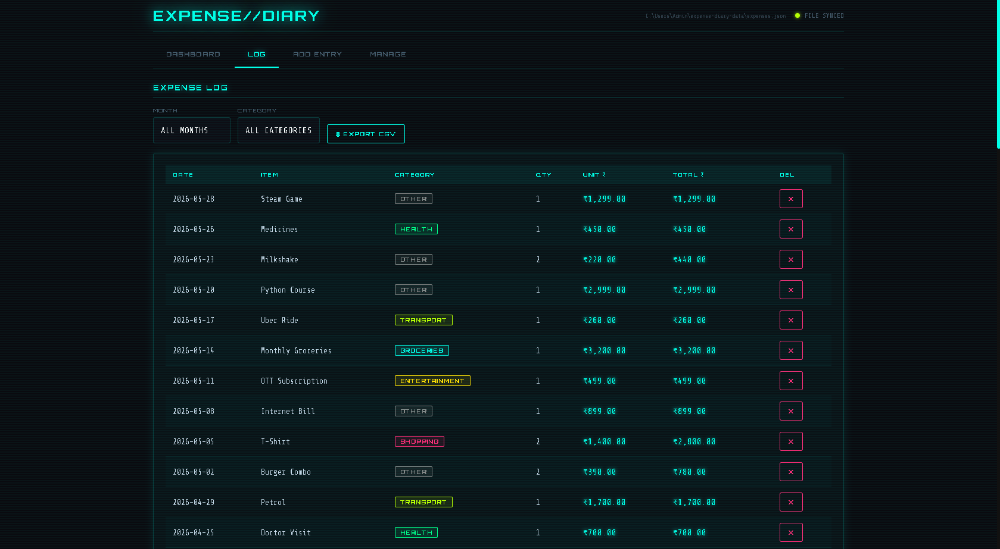

# EXPENSE//DIARY — Cyber Ledger v2077
## Electron Desktop App — Setup Guide


---



### FIRST-TIME SETUP (do this once)

**Requirements:** Node.js installed on your system.
Download from: https://nodejs.org (LTS version)

**Steps:**
1. Unzip / place this folder anywhere on your computer
2. Open a terminal (Command Prompt / PowerShell on Windows, Terminal on Mac/Linux)
3. Navigate into the folder:
   ```
   cd path/to/expense-diary
   ```
4. Install dependencies:
   ```
   npm install
   ```
5. Launch the app:
   ```
   npm start
   ```

---

### LAUNCHING AFTER SETUP

Every time you want to open the app, run:
```
npm start
```
from inside the `expense-diary` folder.

**Windows shortcut tip:** Create a `.bat` file in the folder:
```bat
@echo off
cd /d "%~dp0"
npm start
```
Double-click it to launch.

**Mac/Linux shortcut tip:** Create a shell script `launch.sh`:
```bash
#!/bin/bash
cd "$(dirname "$0")"
npm start
```
Then `chmod +x launch.sh` and double-click.

---

### WHERE YOUR DATA IS STORED

Your expenses are saved to a real JSON file on disk:

- **Windows:** `C:\Users\YourName\expense-diary-data\expenses.json`
- **Mac:**     `/Users/YourName/expense-diary-data/expenses.json`
- **Linux:**   `/home/yourname/expense-diary-data/expenses.json`

The exact path is shown in the app header and in the MANAGE → SYSTEM STATUS panel.
You can open this file in any text editor to inspect or backup your data.

---

### FEATURES
- Dashboard with charts (donut + 6-month bar)
- Full expense log with filters (month + category)
- Add/delete entries
- Import CSV data
- Export CSV (native save dialog)
- Purge all data
- Data written to disk on every save — no browser storage used
